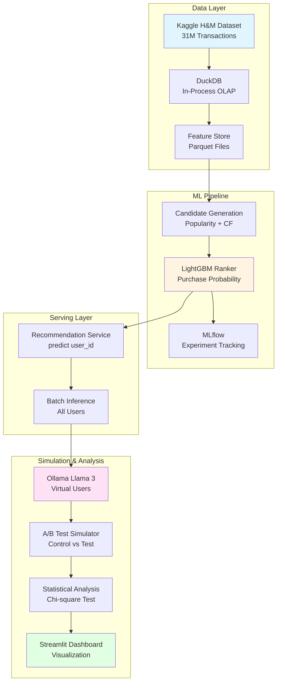
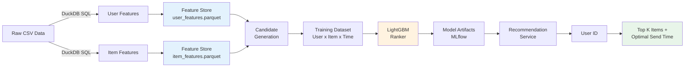

# Local-Helix: 대규모 추천 시스템 구현

<div align="center">


**3천만 건 트랜잭션 데이터를 로컬 환경에서 처리하는 End-to-End 추천 시스템**

[Features](#-key-features) • [Architecture](#-system-architecture) • [Tech Stack](#-tech-stack) • [Getting Started](#-getting-started)

</div>

---

## 📌 Project Overview

Local-Helix는 **로컬 환경에서** H&M의 실제 트랜잭션 데이터(3,100만 건)를 처리하고, LightGBM 기반 랭킹 모델을 활용하여 **개인화된 상품 추천 및 푸시 최적화**를 수행하는 MVP 프로젝트입니다.

### 🎯 프로젝트 목표

이 프로젝트는 다음 질문에 답합니다:
- **누구에게** (Which User): 어떤 유저에게 추천할 것인가?
- **무엇을** (What Item): 어떤 상품을 추천할 것인가?
- **언제** (When): 언제 푸시를 발송하면 전환율이 최대화되는가?

### 💡 프로젝트의 차별점

1. **Infrastructure-less Architecture**: DuckDB를 활용하여 별도의 DB 서버 없이 OLAP 처리
2. **Purchase-based Ranking**: 단순 유사도가 아닌 '구매 확률' 예측 모델 구현
3. **Time-aware Optimization**: 유저별 최적 푸시 발송 시간대 산출
4. **LLM-powered Simulation**: Ollama(Llama 3)를 활용한 가상 유저 A/B 테스트

---

## 🚀 Key Features

### 1. 대용량 데이터 처리 (3천만 건)
- DuckDB를 활용한 In-Process OLAP
- Polars 기반 고성능 DataFrame 처리
- 메모리 효율적인 Feature Engineering

### 2. 2-Stage 추천 시스템
- **Candidate Generation**: Popularity + Item-based CF
- **Ranking Model**: LightGBM을 활용한 구매 확률 예측

### 3. 시간 최적화
- 유저별 평균 구매 시간대 분석
- 시계열 기반 Feature 생성
- 최적 푸시 발송 시간 산출

### 4. 가상 유저 시뮬레이션
- Ollama(Llama 3) 기반 페르소나 생성
- A/B 테스트 시뮬레이션 (Control vs Test)
- 통계적 유의성 검증 (Chi-square test)

### 5. 인터랙티브 대시보드
- Streamlit 기반 실시간 모니터링
- 모델 성능 지표 시각화
- A/B 테스트 결과 분석

---

## 🏗️ System Architecture

### High-Level Architecture



### Data Flow



### ML Model Architecture

```mermaid
graph TB
    subgraph "Input Features"
        A1[User Features<br/>• avg_purchase_hour<br/>• preferred_category<br/>• recency<br/>• purchase_frequency]
        A2[Item Features<br/>• popularity_rank<br/>• peak_hour<br/>• sales_count<br/>• category]
        A3[Context Features<br/>• current_hour<br/>• day_of_week<br/>• season]
    end
    
    A1 --> B[Feature Merger<br/>Cross Join]
    A2 --> B
    A3 --> B
    
    B --> C[LightGBM Ranker<br/>Objective: lambdarank<br/>Metric: NDCG@K]
    
    C --> D[Prediction<br/>Purchase Probability<br/>0.0 ~ 1.0]
    
    D --> E[Top K Selection<br/>K = 10]
    
    E --> F[Final Recommendations<br/>+ Optimal Send Time]
    
    style C fill:#fff3e0
    style F fill:#e8f5e9
```



---

## 🛠 Tech Stack

### Core Technologies

| Category | Technology | Purpose |
|----------|-----------|---------|
| **Database** | DuckDB | In-process OLAP, 대용량 데이터 처리 |
| **Data Processing** | Polars | 고성능 DataFrame 연산 |
| **ML Framework** | LightGBM | Gradient Boosting Ranker |
| **Experiment Tracking** | MLflow | 모델 버전 관리 및 메트릭 로깅 |
| **LLM** | Ollama (Llama 3) | 가상 유저 페르소나 생성 |
| **Visualization** | Streamlit | 인터랙티브 대시보드 |
| **Statistics** | SciPy, Statsmodels | A/B 테스트 통계 분석 |

### Why This Stack?

#### DuckDB
- ✅ 별도 서버 설치 불필요 (In-Process)
- ✅ Parquet/CSV 직접 쿼리 가능
- ✅ 3천만 건 데이터를 로컬에서 빠르게 처리

#### Polars
- ✅ Pandas 대비 10~100배 빠른 성능
- ✅ Lazy Evaluation으로 메모리 효율성
- ✅ Rust 기반 안정성

#### LightGBM
- ✅ Ranking Objective 지원 (lambdarank)
- ✅ 대용량 데이터에서 빠른 학습 속도
- ✅ Feature Importance 분석 용이

---

## 📊 Expected Results

### Model Performance Metrics
- **NDCG@10**: > 0.70
- **Hit Rate@10**: > 0.65
- **Precision@10**: > 0.15

### A/B Test Hypothesis
- **H0**: Control과 Test 그룹 간 CTR 차이 없음
- **H1**: Test 그룹의 CTR이 유의미하게 높음
- **Significance Level**: α = 0.05

---

## 🏁 Getting Started

### Prerequisites

- Python 3.10+
- 16GB+ RAM (32GB 권장)
- 10GB+ 여유 디스크 공간

### Installation

```bash
# 1. Repository Clone
git clone https://github.com/kwang-min13/STEP1.git
cd STEP1

# 2. 가상환경 생성
python -m venv venv
source venv/bin/activate  # Windows: venv\Scripts\activate

# 3. 의존성 설치
pip install -r requirements.txt

# 4. Ollama 설치 및 모델 다운로드
# https://ollama.ai 에서 설치
ollama pull llama3

# 5. Kaggle 데이터셋 다운로드
kaggle competitions download -c h-and-m-personalized-fashion-recommendations
unzip h-and-m-personalized-fashion-recommendations.zip -d data/raw/
```

### Quick Start

```bash
# 1. 데이터 탐색 (EDA)
jupyter notebook notebooks/01_eda.ipynb

# 2. Feature 생성
python src/data/create_features.py

# 3. 모델 학습
python src/models/train_ranker.py

# 4. 추천 생성
python scripts/batch_inference.py

# 5. 시뮬레이션 실행
python scripts/run_simulation.py

# 6. 대시보드 실행
streamlit run app.py
```

---

## 📁 Project Structure

```
Local-Helix/
├── data/
│   ├── raw/                    # Kaggle 원본 데이터
│   ├── processed/              # 전처리된 데이터
│   └── features/               # Feature Store (Parquet)
├── notebooks/
│   └── 01_eda.ipynb           # 탐색적 데이터 분석
├── src/
│   ├── data/                   # 데이터 처리 모듈
│   │   ├── user_features.py
│   │   ├── item_features.py
│   │   └── feature_store.py
│   ├── models/                 # ML 모델 모듈
│   │   ├── candidate_generation.py
│   │   ├── ranker.py
│   │   ├── serving.py
│   │   └── evaluation.py
│   ├── simulation/             # 시뮬레이션 모듈
│   │   ├── llm_client.py
│   │   ├── persona.py
│   │   └── ab_test.py
│   └── analysis/               # 분석 모듈
│       └── statistical_tests.py
├── scripts/                    # 실행 스크립트
│   ├── batch_inference.py
│   └── run_simulation.py
├── models/
│   └── artifacts/              # 학습된 모델 저장
├── logs/                       # 로그 파일
├── app.py                      # Streamlit 대시보드
├── requirements.txt
├── PRD.md                      # 프로젝트 요구사항
├── TASKS.md                    # 구현 가이드
├── TECH_STACK.md              # 기술 스택 상세
└── README.md
```

---

## 🎓 Learning Outcomes

이 프로젝트를 통해 다음을 학습할 수 있습니다:

### 1. 대규모 데이터 처리
- DuckDB를 활용한 In-Process OLAP
- Polars를 활용한 고성능 데이터 처리
- 메모리 효율적인 Feature Engineering

### 2. 추천 시스템 설계
- 2-Stage 추천 시스템 (Candidate Generation + Ranking)
- LightGBM을 활용한 Learning to Rank
- 시계열 데이터를 고려한 Feature 설계

### 3. MLOps 실무
- MLflow를 활용한 실험 관리
- 모델 버전 관리 및 재현성 확보
- 배치 추론 파이프라인 구축

### 4. LLM 활용
- Ollama를 활용한 로컬 LLM 실행
- 프롬프트 엔지니어링 (페르소나 생성)
- LLM 기반 시뮬레이션

### 5. 통계 분석
- A/B 테스트 설계 및 실행
- 통계적 유의성 검증 (Chi-square test)
- 데이터 기반 의사결정

---

## 📈 Performance Optimization

### 데이터 처리 최적화
- Parquet 포맷 사용으로 I/O 성능 향상
- DuckDB의 컬럼 기반 저장으로 쿼리 속도 개선
- Polars의 Lazy Evaluation으로 메모리 효율성 확보

### 모델 학습 최적화
- LightGBM의 Histogram-based 알고리즘으로 학습 속도 향상
- Early Stopping으로 과적합 방지
- Feature Importance 기반 Feature Selection

### 추론 최적화
- 배치 단위 추론으로 처리량 증가
- 후보군 사전 필터링으로 연산량 감소
- 결과 캐싱으로 중복 연산 제거

---

## 🤝 Contributing

이 프로젝트는 학습 목적으로 제작되었습니다. 개선 제안이나 버그 리포트는 Issues를 통해 제출해주세요.

---

## 📝 License

This project is licensed under the MIT License - see the [LICENSE](LICENSE) file for details.

---

## 👨‍💻 Author

**[Your Name]**
- GitHub: [@kwang-min13](https://github.com/kwang-min13)
- Email: your.email@example.com
- LinkedIn: [Your LinkedIn](https://linkedin.com/in/yourprofile)

---

## 🙏 Acknowledgments

- **Dataset**: [Kaggle H&M Personalized Fashion Recommendations](https://www.kaggle.com/competitions/h-and-m-personalized-fashion-recommendations)
- **Inspiration**: 실무 추천 시스템의 End-to-End 파이프라인 구현
- **Technologies**: DuckDB, Polars, LightGBM, Ollama 커뮤니티

---

<div align="center">

**⭐ 이 프로젝트가 도움이 되었다면 Star를 눌러주세요!**

Made with ❤️ for learning and portfolio

</div>
